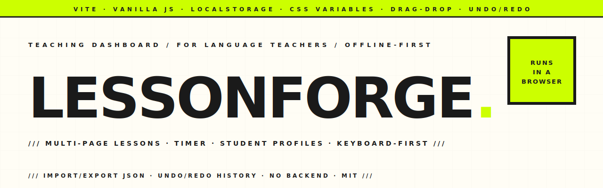

<p align="center">
  <picture>
    <source media="(prefers-color-scheme: dark)" srcset="assets-readme/hero-banner-dark.svg" />
    
  </picture>
</p>

<p align="center">
  <a href="https://github.com/hatimhtm/LessonForge/actions/workflows/ci.yml"></a>
  
  
  
  <a href="LICENSE"></a>
</p>

<p align="center">
  <em>A teaching dashboard for language tutors. Multi-page lessons, a built-in timer, student profiles, drag-and-drop reordering, a categorised toolkit of grammar / vocab / pronunciation cards, undo/redo history, and JSON import/export — all running in a browser tab with zero backend and full offline persistence via <code>localStorage</code>. ~2,500 LOC of vanilla JS on Vite, no framework, no dependencies in the wheel.</em>
</p>

---

### `/// WHAT IT IS`

```
┌─────────────────────────────────────────────────────────────────┐
│ TOOLBAR                                                         │
│ ▸ Page tabs (drag to reorder in edit mode)                      │
│ ▸ Toolkit filters · Timer (stopwatch / countdown)               │
│ ▸ Edit mode · Undo / Redo · Reset session · Print               │
│ ▸ Import / Export JSON · Theme toggle                           │
├──────────────────┬──────────────────────────────────────────────┤
│ CONTENT          │ TOOLKIT (right rail)                         │
│ ▸ Rich-text page │ ▸ Categorised reference cards                │
│   (B / I / U /   │ ▸ Filter by category                         │
│    highlights /  │ ▸ Custom categories                          │
│    lists)        │ ▸ Add / edit / delete in edit mode           │
│ ▸ Auto-saves to  │                                              │
│   localStorage   │ STUDENT PANEL                                │
│   on every edit  │ ▸ Per-student profile + notes                │
│                  │ ▸ Active-student indicator                   │
│                  │                                              │
│                  │ CHECKLIST                                    │
│                  │ ▸ Per-session checkbox state                 │
│                  │ ▸ Cleared on "Reset session"                 │
└──────────────────┴──────────────────────────────────────────────┘
```

---

### `/// WHY IT EXISTS`

Most lesson-prep tools either lock you into a SaaS subscription or expect you to live inside Google Docs / Notion. LessonForge fits the actual tutoring workflow: open a tab between Zoom calls, swipe through the lesson plan, click "next page" mid-class, hit space to start the timer, scribble in the rich-text editor while the student is talking, undo a wrong edit, export the whole plan as JSON when the lesson's done.

Built for **one teacher**, **one device**, **no signups, no sync, no servers** — just `localStorage` and a print stylesheet for when you need a paper copy.

---

### `/// HIGHLIGHTS`

| | |
|---|---|
| **Multi-page lessons** | Tabs for Warm-Up / Vocab / Grammar / Practice / Wrap-Up. Drag the tab order in edit mode. Per-page rich-text content survives reloads. |
| **Rich-text editor** | `contenteditable` body with bold / italic / underline / highlight / lists. No external editor lib — just `document.execCommand` for the basics. |
| **Toolkit cards** | Categorised reference cards (grammar rules, vocab, connectors, pronunciation tips, conjugations). Filter by category. Add custom categories. |
| **Built-in timer** | Stopwatch + countdown modes. Survives tab switches via `setInterval`. |
| **Student profiles** | Per-student name, level, notes. Active-student indicator at the top of the right rail. |
| **Session checklist** | Per-session todos (warm-up done, homework collected, etc.). One-click "Reset session" clears boxes + timer + temporary notes — but not your lesson plan. |
| **Undo / Redo history** | 50-step ring buffer in `state.js`. Every meaningful change snapshots. Keyboard shortcuts `Ctrl/⌘+Z` and `Ctrl/⌘+Shift+Z`. |
| **Import / Export** | One click for JSON (full state) or Markdown (lesson plan, share-ready). Round-trip between machines, hand a printable to a co-teacher. |
| **⌘K command palette** | Single keystroke jumps to any page, student, or toolkit card. Run actions ("Export Markdown", "Toggle theme", "Insert template") without leaving the keyboard. |
| **Starter templates** | Six archetypes — conversation, grammar focus, business English, exam prep (IELTS/TOEFL), absolute beginner, young learners — append as new pages with one click. |
| **PWA / Service worker** | Installable on iPad or desktop, fully offline after first load. No CDN round-trip when you open a new lesson between Zoom calls. |
| **Save indicator** | Toolbar pill shows "Saved · 3s ago" so you always know `localStorage` caught the last edit. |
| **Timer chime** | Web Audio API ding-ding-ding on countdown zero + on-screen toast — never miss the end of a 5-minute round-robin. |
| **Dark mode** | Sakura-pink light theme + deep-plum dark theme. Preference persists across reloads. |
| **Print stylesheet** | Dedicated `print.css` strips the chrome and prints the active lesson page cleanly for in-class handouts. |
| **Keyboard shortcuts** | `⌘K` palette · `⌘Z` / `⌘⇧Z` undo / redo · `⌘S` export · `E` edit mode · `1`–`9` page · `0` timer · `?` shortcuts. |

---

### `/// PROJECT LAYOUT`

```
LessonForge/
├── index.html                        single-page shell — toolbar + content + sidebar
├── package.json                      vite only — zero runtime deps
├── vite.config.js
├── src/
│   ├── main.js                       app controller — render · events · drag · timer
│   ├── state.js                      StateManager — localStorage · undo/redo · snapshots
│   ├── data.js                       default lessons + cards + categories + checklist
│   └── styles/
│       ├── variables.css             tokens — colors, fonts, spacing, radii, shadows
│       ├── layout.css                page grid + toolbar layout
│       ├── toolbar.css               action buttons, dropdowns, timer chip
│       ├── content.css               rich-text editor + page tabs
│       ├── toolkit.css               right-rail cards + filter chips
│       ├── sidebar.css               student panel + session checklist
│       ├── shortcuts.css             keyboard-shortcut hint chip
│       └── print.css                 print-only stylesheet (strips chrome)
└── assets-readme/                    brutalist banner SVGs (light + dark)
```

---

### `/// LOCAL DEV`

```bash
git clone https://github.com/hatimhtm/LessonForge.git
cd LessonForge
npm install
npm run dev          # vite dev server → http://localhost:5173
npm run build        # production bundle → dist/
npm run preview      # serve dist/ → http://localhost:4173
```

Static output — drop `dist/` on any host (Vercel, Netlify, GitHub Pages, S3, your own teacher portal).

---

### `/// CUSTOMISATION`

- **Theme:** edit `src/styles/variables.css`. CSS custom properties drive every color, radius, shadow, font stack.
- **Default lessons:** edit `src/data.js`. `defaultPages` / `defaultTools` / `defaultCategories` / `defaultChecklist` populate the first run; subsequent sessions load from `localStorage`.
- **Add a category:** in edit mode, click the "+" next to the category chips. State persists automatically.
- **Replace the icons:** the FontAwesome CDN load can be swapped for Lucide / Phosphor / Heroicons by editing two lines in `index.html` and the icon classes throughout.

---

### `/// 2.0 — OVERHAUL`

The 2.0 release pushed past polish into the actual product surface:

- **Custom `<dialog>` modal system** replaces every native `prompt` / `confirm` / `alert`. Focus-trapped, Esc-closes, screen-reader friendly — and finally consistent with the theme.
- **PWA + service worker**. `manifest.webmanifest` + an offline-first cache layer means LessonForge installs to the home screen and survives no-wifi classrooms.
- **⌘K command palette** spans pages, students, toolkit cards, and one-shot actions (Insert template, Export Markdown, Toggle theme).
- **Starter-lesson templates** — six teaching archetypes append as new pages.
- **Save-status indicator** in the toolbar (`Saved · 3s ago`) — never wonder if the last edit hit `localStorage`.
- **Markdown export** alongside JSON for share-ready handouts.
- **Web Audio chime** + on-screen toast when a countdown hits zero.
- **Persisted dark theme** (deep-plum) alongside the original sakura light theme.
- **Brutalist house-style README**, light/dark hero banners, OG + Twitter cards, `theme-color`, inline SVG favicon, **CI** that builds + sanity-checks `dist/` on every push.

---

### `/// LICENSE`

[MIT](LICENSE). Fork it, ship your own teacher dashboard, change the colour palette, re-skin it for any subject (it's hardcoded for languages but the bones are general). Just keep the copyright line.

---

<p align="center">
  <a href="https://hatimelhassak.is-a.dev"></a>
  <a href="https://cal.com/hatimelhassak/engineering-discovery"></a>
  <a href="https://www.linkedin.com/in/hatim-elhassak/"></a>
  <a href="mailto:hatimelhassak.official@gmail.com"></a>
</p>

<p align="center">
  <code>///&nbsp;&nbsp;OPEN FOR NEW WORK&nbsp;&nbsp;///&nbsp;&nbsp;CONTRACT &amp; FREELANCE&nbsp;&nbsp;///&nbsp;&nbsp;REMOTE WORLDWIDE&nbsp;&nbsp;///</code>
</p>
